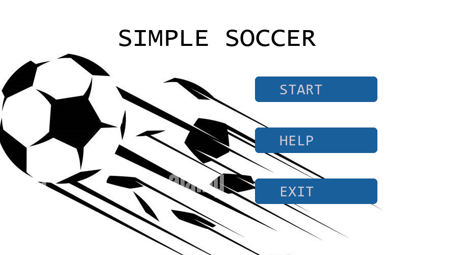

# simple_soccer

- with a friend enjoy a nice 2D game of football 

 

https://user-images.githubusercontent.com/80308387/212550623-f5131e40-f81b-4d7c-a883-c39006fd3779.mp4

> run the game with 
  * python game.py 
> tinker with the speed controls and other global  variables  in the scripts for
> better adjustment ./ just change number values
#  RESULTS LOCATION : "RESULTS.txt"
- Dependencies 
- > pygame  
